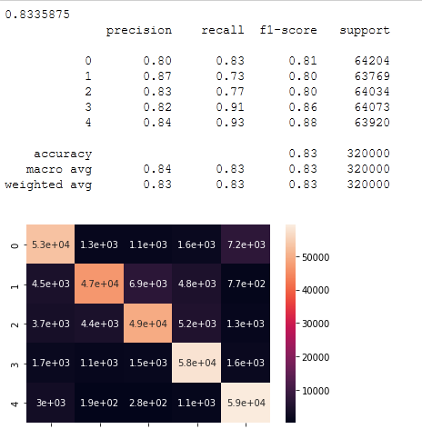

<h1>Table of Contents<span class="tocSkip"></span></h1>
<div class="toc"><ul class="toc-item"><li><span><a href="#Introduction" data-toc-modified-id="Introduction-1"><span class="toc-item-num">1&nbsp;&nbsp;</span>Introduction</a></span></li><li><span><a href="#Problem-Statement" data-toc-modified-id="Problem-Statement-2"><span class="toc-item-num">2&nbsp;&nbsp;</span>Problem Statement</a></span></li><li><span><a href="#Work-Flow" data-toc-modified-id="Work-Flow-3"><span class="toc-item-num">3&nbsp;&nbsp;</span>Work Flow<a name="work"></a></a></span></li><li><span><a href="#Data-Description" data-toc-modified-id="Data-Description-4"><span class="toc-item-num">4&nbsp;&nbsp;</span>Data Description<a name="datadesc"></a></a></span></li><li><span><a href="#Data-Visualization-" data-toc-modified-id="Data-Visualization--5"><span class="toc-item-num">5&nbsp;&nbsp;</span>Data Visualization <a id="datavisu"></a></a></span><ul class="toc-item"><li><span><a href="#Word-count" data-toc-modified-id="Word-count-5.1"><span class="toc-item-num">5.1&nbsp;&nbsp;</span>Word count</a></span></li><li><span><a href="#Word-Clouds-to-visualise" data-toc-modified-id="Word-Clouds-to-visualise-5.2"><span class="toc-item-num">5.2&nbsp;&nbsp;</span>Word Clouds to visualise</a></span></li></ul></li><li><span><a href="#Data-Preprocessing" data-toc-modified-id="Data-Preprocessing-6"><span class="toc-item-num">6&nbsp;&nbsp;</span>Data Preprocessing<a name="dataPre"></a></a></span></li><li><span><a href="#Feature-Selections" data-toc-modified-id="Feature-Selections-7"><span class="toc-item-num">7&nbsp;&nbsp;</span>Feature Selections</a></span></li><li><span><a href="#Machine-Learning-Model-Creation" data-toc-modified-id="Machine-Learning-Model-Creation-8"><span class="toc-item-num">8&nbsp;&nbsp;</span>Machine Learning Model Creation</a></span><ul class="toc-item"><li><span><a href="#Assessing-Model-Performance" data-toc-modified-id="Assessing-Model-Performance-8.1"><span class="toc-item-num">8.1&nbsp;&nbsp;</span>Assessing Model Performance</a></span></li></ul></li><li><span><a href="#Conclusion" data-toc-modified-id="Conclusion-9"><span class="toc-item-num">9&nbsp;&nbsp;</span>Conclusion</a></span></li><li><span><a href="#Future-Scope" data-toc-modified-id="Future-Scope-10"><span class="toc-item-num">10&nbsp;&nbsp;</span>Future Scope</a></span></li></ul></div>

#  Introduction
The consumer files complaint when they are unsatisfied by the service or product offered by the company. they seek action against on the issue from the companies. Companies do sometimes solve issues of the consumer but in many cases consumer don’t get the expected results. in such cases financial mediators comes into play to solve the disputes between customer and financial companies

# Problem Statement
To classify consumer complaints of financial products using NLP techniques and classification models
Business case:
    An NLP model would make the classification of complaints and their routing to the appropriate teams more efficient than manually tagged complaints.

# Work Flow<a name="work"></a>


Customer Churn Prediction for Telecommunication Industry is a Kaggle Machine Learning problem. Therefore, procuring the data for this project was straightforward. I downloaded the data set from Kaggle and loaded it into my jupyter notebook. Additionally, I also imported the requisite libraries which were essential for completing this project. The only task required now was to analyse the data, clean it, and train an ML model using the cleaned data set.


# Data Description<a name="datadesc"></a>
*What is Consumer complaints?*      
Internet forums and the advent of social media have provided consumers with a new way to submit complaints. Consumer news and advocacy websites often accept and publish complaints. Publishing complaints on highly visible websites increases the likelihood that the general public will become aware of the consumer's complaint. If, for example, a person with many "followers" or "friends" publishes a complaint on social media, it may go "viral". Internet forums in general and on complaint websites have made it possible for individual consumers to hold large corporations accountable in a public forum.

Dataset Details:

A data file was downloaded directly from the CFPB website for training and testing the model. It included one year's worth of data (March 2020 to March 2021). Later in the project, I used an API to download up-to-the-minute data to verify the model's performance.

Each submission was tagged with one of nine financial product classes. Because of similarities between certain classes as well some class imbalances, I consolidated them into five classes:
1.	credit reporting
2.	debt collection
3.	mortgages and loans (includes car loans, payday loans, student loans, etc.)
4.	credit cards
5.	retail banking (includes checking/savings accounts, as well as money transfers, Venmo, etc.)        

After data cleaning, the dataset consisted of around 162,400 consumer submissions containing narratives. The dataset was still imbalanced, with 56% in the credit reporting class, and the remainder roughly equally distributed (between 8% and 14%) among the remaining classes.

Data Collection
The case study in the project is a telecommunications company. We have collected the data from the Kaggle website. The link to the data can be found here – 

< href = https://www.kaggle.com/shashwatwork/consume-complaints-dataset-fo-nlp >


# Data Visualization <a id="datavisu"></a>
After data cleaning, the dataset consisted of around 162,400 consumer submissions containing narratives. The dataset was still imbalanced, with 56% in the credit reporting class, and the remainder roughly equally distributed (between 8% and 14%) among the remaining classes. This Plot shows that data is not balanced which may cause low accuracy to the minority classes so we need to make data balanced


                                                                    Figure 1– Customer complaints classification
                                                                    
These words are all so commonly occuring words which you could find just anywhere else.Therefore we must find some way to preprocess our dataset first to strip out all these commonly occurring words which do not bring much to the table. 


## Word count
 | 
 | 


## Word Clouds to visualise  

each author's work One very handy visualization tool for a data scientist when it comes to any sort of natural language processing is plotting "Word Cloud". A word cloud (as the name suggests) is an image that is made up of a mixture of distinct words which may make up a text or book and where the size of each word is proportional to its word frequency in that text (number of times the word appears). Here instead of dealing with an actual book or text, our words can simply be taken from the column "text"     
Exploratory Data Analysis (EDA) and Word clouds -   
    Analyzing the data by generating simple statistics such word frequencies over the different authors as well as plotting some word clouds.


# Data Preprocessing<a name="dataPre"></a>

Data pre-processing is a process of preparing the raw data and making it suitable for machine learning model. It is the first and crucial step while creating a machine learningmodel.      
When creating a machine learning project, it is not always a case that we come acrossthe clean and formatted data. A real-world data generally contains noises, missing values, andmaybe in an unusable format which cannot be directly used for machine learning models. Datapre-processing is required tasks for cleaning the data and making it suitable for a machinelearning model which also increases the accuracy and efficiency of a machine learning model.   

**Exploratory Data Analysis (EDA) and Word clouds -** Analyzing the data by generating simple statistics such word frequencies over the different authors as well as plotting some word clouds (with image masks).

**Natural Language Processing (NLP) with NLTK (Natural Language Toolkit) -** Introducing basic text processing methods such as tokenization, stop word removal, stemming and vectorizing text via term frequencies (TF) as well as the inverse document frequencies (TF-IDF)
Data pre-processing involves preparing and "cleaning" text data for machines to be able to analyze it. pre-processing puts data in workable form and highlights features in the text that an algorithm can work with. There are several ways this can be done, including:
    •	Tokenization: This is when text is broken down into smaller units to work with.   
    •	Stop word removal: This is when common words are removed from text so unique words that offer the most information about the text remain.     
    •	Lemmatization and stemming: This is when words are reduced to their root forms to process.     


# Feature Selections
We will have another problem which is what features to consider. Since this is a classification problem and has a lot of categorical inputs, tree-based classification models are a good fit. We will start fitting a regular decision tree or random forest and extract the feature which splits a lot of data across estimators. Getting the top variables which explain most of the variations can help us in feature selection.
We tried various approaches to understand the feature selection like decision Tree, Random Forest. The best model to predict the top features to classify the customers was Logistic Regression. Hence, we used it to get the top features useful for classifying the consumers complaints.


# Machine Learning Model Creation
With the data exploration and engineering stage now complete, I move on towards training my Machine Learning model.
1. Logistic Regression
    
    
    
2. Mulitnomial Naive Bayes:
    
    
    

3. Decision Tree
    
    
    
    
4. Random Forest
   
   
    
    
## Assessing Model Performance


This is the final step of my Machine Learning project, which is to test the performance of my ML models. This step is crucial since I can gauge the accuracy of my ML models on unseen customer data. To determine the performance of my ML model, I used the test data and calculated the accuracy score as well as the confusion matrix for the predicted labels. The accuracy score for the Random Forest model was 92%. Out of 320000 a total of 298000 labels were accurately predicted, also the recall and precision for all classes is high. I can see that the recall of the model is about 93% meaning the model correctly identified about 93% of the customers that were retained and missed about 7%.

# Conclusion
The predictions from the ML model can help in understanding the customers who might leave and their service. The accuracy score for the Random Forest model was 92%. Out of 320000 a total of 298000 labels were accurately predicted

# Future Scope
*	The model can be deployed to run on a regular basis to understand the changes in the behaviour of the customers and the relationship managers can act accordingly.      
*	Model can save lot of human hours for classification of the complaints, also model may work efficiently and more accurately than human.     
*	Getting more data may further increase performance of the model. 


```python

```
